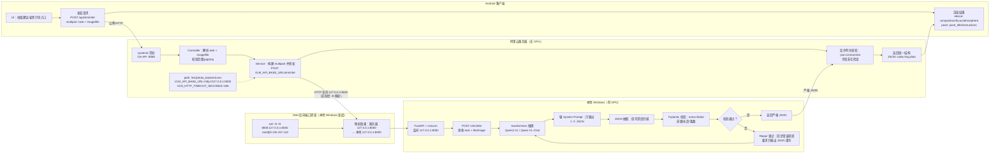
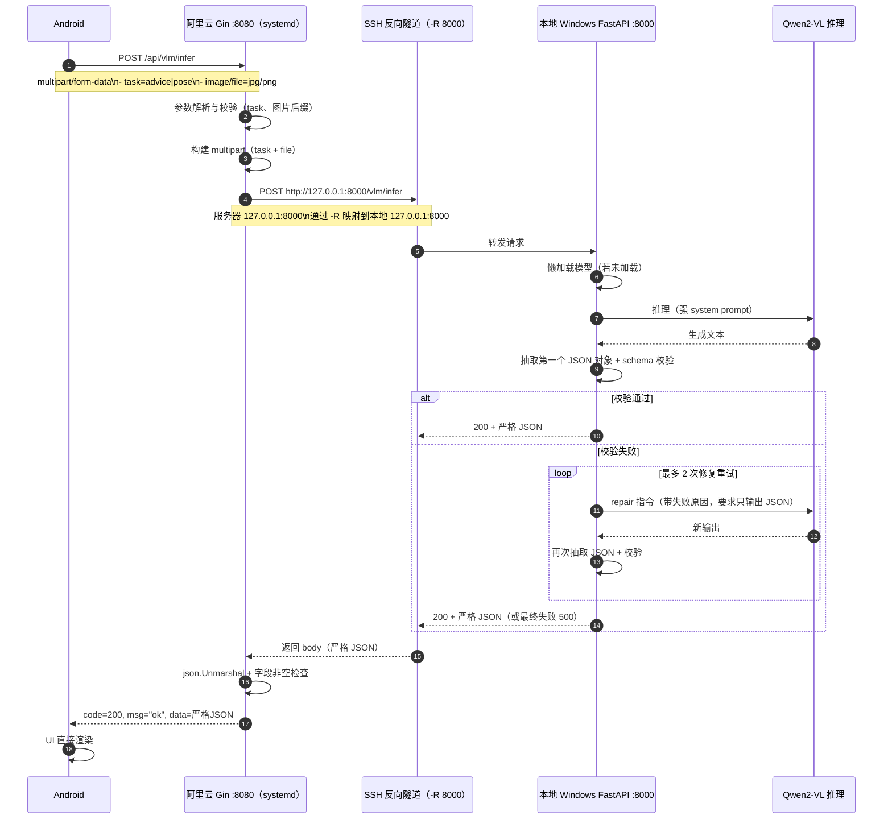

# advice / pose（拍摄建议 + 人像姿势指导）联调与对接说明

更新时间：2026-03-16

本文档用于说明【拍摄建议（advice）】与【人像姿势指导（pose）】两项能力在本项目中的**整体逻辑、部署形态、接口契约、推理流程、以及前端/Android 需要如何对接**。

---

## 1. 你们实现的是什么能力

### 1.1 拍摄建议（advice）

输入：一张图片
输出：严格结构化 JSON（仅 3 个字段），用于 UI 直接渲染

```json
{
  "composition": "构图优化：...",
  "focus": "焦点调整：...",
  "atmosphere": "氛围强化：..."
}
```

### 1.2 人像姿势指导（pose）

输入：一张图片
输出：严格结构化 JSON（仅 2 个字段），用于 UI 直接渲染

```json
{
  "pose_title": "✨ 推荐姿势：...",
  "instructions": ["...", "...", "..."]
}
```

---

## 2. 总体架构（端到端链路）

本项目采用“业务后端（Go/Gin）+ 推理服务（Python/FastAPI）”的分层方式：

1) Android/前端把图片发给 Go 后端：

- `POST /api/vlm/infer`（multipart/form-data）

2) Go 后端把图片与 task 转发给 Python VLM：

- `POST /vlm/infer`（multipart/form-data）

3) Python VLM（Qwen2-VL）在 GPU 上执行推理，输出**严格 JSON**
4) Go 后端对 JSON 做反序列化校验后，包装成统一返回结构返回给 Android/前端：

```json
{
  "code": 200,
  "msg": "ok",
  "data": { ...严格 JSON... }
}
```

> 你们当前已经验证：服务器侧 `:8080` 的 Go 后端可通过“隧道/内网”访问本地 GPU 的 VLM 服务，并成功返回 200。

### 2.1 VLM 联调逻辑图（Android / 阿里云服务器 / 本地 Windows GPU）

下面这张图把 **3 台机器之间的关系**、**端口映射原理**、以及 **VLM 严格 JSON 输出的实现闭环**串起来（当前你们的联调形态就是这样）。



### 2.2 一次请求的时序图（含 JSON 校验 + 修复重试）



读图说明（你们当前“为什么服务器没 GPU 也能跑通”）：

- 服务器 Go 并没有直接运行大模型；它只是把图片转发给 `VLM_API_BASE_URL`。
- `VLM_API_BASE_URL` 之所以能写成 `http://127.0.0.1:8000`，是因为 **SSH 反向端口转发**让“服务器的 127.0.0.1:8000”被映射到“本地 Windows 的 127.0.0.1:8000”。
- Python VLM 侧为了保证 UI 可直接渲染，采用“强约束 prompt + JSON 抽取 + schema 校验 + 失败自动修复重试”的闭环，最终只返回严格 JSON。

---

## 3. 运行位置：训练在哪里？推理在哪里？

### 3.1 用的是什么模型

- 模型：`Qwen/Qwen2-VL-2B-Instruct`
- 类型：多模态视觉语言模型（VLM），支持“输入图片 + 文本指令 → 输出文本”
- 推理框架：HuggingFace `transformers`

### 3.2 有无训练/微调？

当前方案是：**不进行训练/微调**。

- 这里的“强结构化输出”不是靠训练得到的，而是靠：
  1) 强 System Prompt（禁止多余文本、禁止 Markdown、禁止额外字段）
  2) 严格 Schema 校验（不通过就重试修复）
  3) JSON 抽取与修复策略（防止模型输出夹杂说明文字）

> 因此“训练在哪里”这一项：本阶段没有训练管线与训练服务器需求。

### 3.3 推理在哪里执行

- **推理在 Python VLM 服务所在机器执行**，且建议有 GPU。

你们当前联调形态是：

- 本地 Windows（有 GPU）运行 Python VLM（FastAPI/Uvicorn，端口 8000）
- 阿里云服务器（无 GPU）运行 Go 后端（Gin，端口 8080）
- 通过 SSH 反向端口转发，让服务器 `127.0.0.1:8000` 实际访问到本地 VLM

这种方式适合开发联调，但不适合作为最终生产形态（因为依赖开发机在线与隧道稳定）。

---

## 4. Python VLM 服务（FastAPI）说明

### 4.1 服务目标

- 接收图片与任务类型（advice/pose）
- 运行多模态模型推理
- **只返回严格 JSON**，让前端/Android 无需做复杂 NLP 解析

### 4.2 接口

#### 4.2.1 健康检查

- `GET /health`
- 返回：

```json
{ "status": "ok", "model_id": "Qwen/Qwen2-VL-2B-Instruct", "dry_run": false }
```

#### 4.2.2 模型状态

- `GET /model/status`
- 返回是否已加载、是否在加载、是否有错误、CUDA 是否可用等

#### 4.2.3 推理

- `POST /vlm/infer`
- Content-Type: `multipart/form-data`
- 字段：
  - `task`：`advice` 或 `pose`（必填）
  - 图片字段名：`file` 或 `image`（两者都兼容）

返回：严格 JSON（见第 6 节“输出契约”）

### 4.3 推理策略（为什么能保证严格 JSON）

**核心目标：输出可被 `json.loads` / `json.Unmarshal` 直接解析，并且字段严格匹配 UI。**

实现逻辑：

1) System Prompt 强制约束：

- 禁止 Markdown/代码块/解释
- 只能输出一个 JSON 对象
- key 必须固定（advice 3 个，pose 2 个）
- 值必须满足前缀、长度等规则

2) 生成后校验：

- 抽取第一个 JSON 对象（括号深度配对扫描）
- `json.loads`
- Pydantic Schema 校验：
  - 禁止 extra 字段（extra=forbid）
  - 字符串前缀校验（如 `构图优化：`）
  - pose 指令数组长度范围等

3) 校验失败 → 自动修复重试：

- 将“失败原因”回注给模型，要求它只输出 JSON 重写
- 最多多轮重试，直到输出符合契约或返回 500

这种方式不依赖训练，就能让输出结构稳定。

### 4.4 关键环境变量（Python）

- `VLM_MODEL_ID`：模型 id（默认 `Qwen/Qwen2-VL-2B-Instruct`）
- `VLM_DRY_RUN`：`1` 时不跑模型，直接返回固定 JSON（用于快速联调）
- `VLM_BACKGROUND_LOAD`：后台加载模型（减少首次请求超时）
- `VLM_MAX_CONCURRENT`：并发限制（避免 GPU OOM）
- `VLM_MAX_NEW_TOKENS` / `VLM_TEMPERATURE` / `VLM_TOP_P`：生成参数

---

## 5. Go 后端接口（Gin）说明

### 5.1 对外接口（前端/Android 调用）

#### `POST /api/vlm/infer`

- Content-Type: `multipart/form-data`
- 字段：
  - `task`：`advice` 或 `pose`
  - 图片字段名：`image` 或 `file`（两者都兼容）

返回（统一包装）：

```json
{
  "code": 200,
  "msg": "ok",
  "data": {
    // advice 或 pose 的严格 JSON
  }
}
```

错误返回示例：

```json
{ "code": 400, "msg": "task 只能是 advice 或 pose" }
```

```json
{ "code": 500, "msg": "VLM 推理失败", "error": "..." }
```

### 5.2 Go → Python 的转发配置

Go 侧通过环境变量决定转发到哪个 Python 服务：

- `VLM_API_URL`：完整 URL（优先级最高），例：`http://127.0.0.1:8000/vlm/infer`
- `VLM_API_BASE_URL`：基础地址，例：`http://127.0.0.1:8000`（会自动拼 `/vlm/infer`）
- `VLM_HTTP_TIMEOUT_SECONDS`：转发超时（默认 120 秒，建议 180 秒）

如果服务器端用 systemd 常驻运行 Go 服务，建议把这些环境变量统一写进 `/etc/photo_backend.env`（由 service 的 `EnvironmentFile` 加载），避免每次手动 `export`。

### 5.3 为什么服务器没 GPU 也能跑通（开发联调形态）

你们当前服务器没有 GPU，但推理发生在你本地 GPU，因此可以用 SSH 反向端口转发：

- 本地跑 Python：`127.0.0.1:8000`
- 本地执行：

```bash
ssh -N -R 8000:127.0.0.1:8000 root@8.130.157.142 -p 22
```

这样服务器上的 `127.0.0.1:8000` 会映射到本地的 `127.0.0.1:8000`。

服务器侧将：

```bash
export VLM_API_BASE_URL='http://127.0.0.1:8000'
```

即可把 Go → Python 推理请求“穿隧道”打到你本地 GPU。

> 注意：这种方式用于联调很好，但生产部署建议换成 GPU 服务器承载 Python 推理。

---

## 6. 严格输出契约（前端/Android 必须按此渲染）

### 6.1 advice 输出契约

- 必须只有 3 个 key：`composition`、`focus`、`atmosphere`
- 3 个 value 都是中文字符串
- 必须分别以以下前缀开头：
  - `composition`：`构图优化：`
  - `focus`：`焦点调整：`
  - `atmosphere`：`氛围强化：`

### 6.2 pose 输出契约

- 必须只有 2 个 key：`pose_title`、`instructions`
- `pose_title`：必须以 `✨ 推荐姿势：` 开头，且后面必须有具体名称
- `instructions`：字符串数组，长度 3~6

### 6.3 外层统一包装（Go 返回）

前端/Android 渲染时以 `code` 判断成功：

- `code == 200`：读取 `data`
- 否则：展示 `msg`，必要时上报 `error`

---

## 7. 前端/Android 对接怎么做（必须做的事）

### 7.1 只需要调用一个接口

前端/Android 不需要直接接 Python，只需要接 Go：

- BaseURL（示例）：`http://8.130.157.142:8080/api/`
- 接口：`POST vlm/infer`

### 7.2 请求格式（multipart）

- `task`：字符串，值为 `advice` 或 `pose`
- 图片 part：字段名建议用 `file`（也兼容 `image`）
- 文件名必须带后缀（.jpg/.png），否则服务端可能无法做类型兜底

### 7.3 超时与加载态

模型推理耗时通常为几秒到十几秒（取决于 GPU 与并发），因此：

- 客户端超时建议 ≥ 60 秒，联调期建议 180 秒
- UI 需要有 loading 状态

### 7.4 渲染逻辑（最简）

- advice：展示三块文本

  - 构图优化：`composition`
  - 焦点调整：`focus`
  - 氛围强化：`atmosphere`
- pose：

  - 标题：`pose_title`
  - 列表：`instructions[]`

> 本阶段输出已经严格结构化，所以前端不需要再做“从长文本里抽取要点”。

---

## 7.5 Android / Kotlin（Retrofit）最小可用示例

> 说明：下面示例仅覆盖“能调通 + 能拿到结构化 JSON”。你们可以按项目既有的网络层封装/协程/错误处理风格改造。

### 7.5.1 数据结构

外层统一响应：

```kotlin
data class ApiResponse<T>(
  val code: Int,
  val msg: String,
  val data: T? = null,
  val error: String? = null
)
```

advice：

```kotlin
data class ShootingAdvice(
  val composition: String,
  val focus: String,
  val atmosphere: String
)
```

pose：

```kotlin
data class PoseGuide(
  val pose_title: String,
  val instructions: List<String>
)
```

### 7.5.2 API 定义

```kotlin
import okhttp3.MultipartBody
import okhttp3.RequestBody
import retrofit2.http.Multipart
import retrofit2.http.POST
import retrofit2.http.Part

interface PhotoApi {
  @Multipart
  @POST("vlm/infer")
  suspend fun inferVlm(
    @Part file: MultipartBody.Part,
    @Part("task") task: RequestBody,
  ): ApiResponse<Any>

  // 如果你们希望强类型（推荐），也可以拆成两个方法：
  // suspend fun inferAdvice(...): ApiResponse<ShootingAdvice>
  // suspend fun inferPose(...): ApiResponse<PoseGuide>
}
```

> 注意：因为同一个接口会根据 task 返回不同 data 结构，很多团队会用 `Any` 接住，再按 task 分支解析；也可以定义一个“密封类/泛型封装”做更强类型约束。

### 7.5.3 Multipart 组装（从 Uri）

```kotlin
import android.content.Context
import android.net.Uri
import okhttp3.MediaType.Companion.toMediaTypeOrNull
import okhttp3.MultipartBody
import okhttp3.RequestBody
import okhttp3.RequestBody.Companion.toRequestBody

fun textPart(s: String): RequestBody = s.toRequestBody("text/plain".toMediaTypeOrNull())

fun buildImagePart(context: Context, uri: Uri): MultipartBody.Part {
  val bytes = context.contentResolver.openInputStream(uri)!!.use { it.readBytes() }

  // 重要：文件名必须带后缀，否则后端可能无法做类型兜底
  val filename = "upload.jpg"

  val body = bytes.toRequestBody("image/*".toMediaTypeOrNull())
  return MultipartBody.Part.createFormData("file", filename, body)
}
```

> 字段名建议用 `file`（后端也兼容 `image`）。

### 7.5.4 调用示例（协程）

```kotlin
suspend fun requestAdvice(api: PhotoApi, imagePart: MultipartBody.Part): ApiResponse<ShootingAdvice> {
  val raw = api.inferVlm(imagePart, textPart("advice"))
  if (raw.code != 200 || raw.data == null) {
    return ApiResponse(code = raw.code, msg = raw.msg, data = null, error = raw.error)
  }
  // raw.data 是 Any，这里按你们项目的 JSON 工具（Gson/Moshi/Kotlinx）做一次转换
  // 伪代码：val advice = gson.fromJson(gson.toJson(raw.data), ShootingAdvice::class.java)
  TODO("convert raw.data to ShootingAdvice")
}

suspend fun requestPose(api: PhotoApi, imagePart: MultipartBody.Part): ApiResponse<PoseGuide> {
  val raw = api.inferVlm(imagePart, textPart("pose"))
  if (raw.code != 200 || raw.data == null) {
    return ApiResponse(code = raw.code, msg = raw.msg, data = null, error = raw.error)
  }
  TODO("convert raw.data to PoseGuide")
}
```

### 7.5.5 超时建议（OkHttp）

推理通常 5~15 秒，联调期建议把超时调大：

```kotlin
import okhttp3.OkHttpClient
import java.util.concurrent.TimeUnit

val okHttp = OkHttpClient.Builder()
  .connectTimeout(30, TimeUnit.SECONDS)
  .readTimeout(180, TimeUnit.SECONDS)
  .writeTimeout(180, TimeUnit.SECONDS)
  .build()
```

---

## 7.6 Android UI 最小渲染建议

- advice：三个 TextView/卡片区域分别展示 `composition`、`focus`、`atmosphere`
- pose：一个标题 TextView 展示 `pose_title`；RecyclerView/List 展示 `instructions`
- 交互：请求中显示 loading；失败时 toast/dialog 展示 `msg`

---

## 8. 验收用例（后端/前端共同遵循）

### 8.1 基础用例

- 上传正常 jpg
- `task=advice` 返回 code=200，data 三字段齐全
- `task=pose` 返回 code=200，data 标题+数组齐全

### 8.2 错误用例

- task 缺失：应返回 code=400
- task 非法：应返回 code=400
- 非图片文件：应返回 code=400

---

## 9. 常见问题排查

### 9.1 服务器能 health，但 infer 失败

- 先确认隧道还活着（开发机 ssh 反向转发窗口不能关）
- 服务器执行：`curl http://127.0.0.1:8000/health`

### 9.2 返回 422 missing file

- 说明 Python 没收到文件字段。当前已兼容 `file/image` 字段名；若仍出现，多半是上游请求没有真正带文件。

### 9.3 8080 启动失败 address already in use

- 说明旧后端进程占用端口。
- 用：`ss -ltnp | grep ':8080'` 找 PID，停掉旧进程。

### 9.4 响应慢/超时

- 推理需要时间；加大客户端超时；必要时降低并发（`VLM_MAX_CONCURRENT=1`）

---

## 10. 生产化建议（简述）

联调阶段可以“服务器 Go + 本地 GPU Python + SSH 隧道”。

真正上线建议：

- 让 Python VLM 跑在可 7x24 的 GPU 机器（GPU 云主机/AutoDL/自建 GPU 节点）
- Go 后端配置 `VLM_API_BASE_URL` 指向 GPU 推理机内网地址
- Python 端口不要直接公网暴露（通过内网/安全组限制访问）
