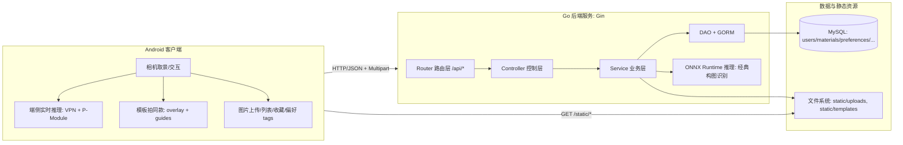
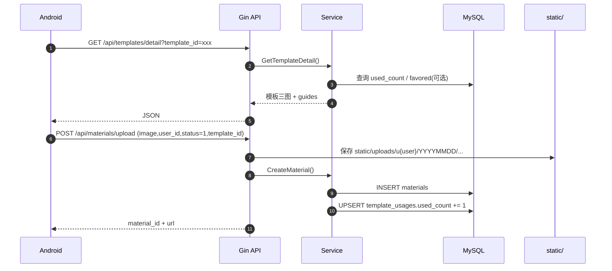
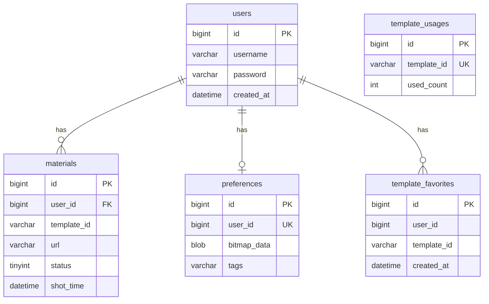

# 中国大学生计算机设计大赛｜软件开发类作品开发文档

- 作品名称：一拍即合（智能构图摄影辅助系统）
- 版本编号：V1.0（端云协同演示版）
- 作者：__________
- 填写日期：2026-03-15

## 目录

- 第一章 需求分析
  - 1.1 开发背景
  - 1.2 市场分析
    - 1.2.1 核心痛点
    - 1.2.2 目标用户
    - 1.2.3 竞品分析
- 第二章 概要设计
  - 2.1 系统架构设计（端云协同 + 分层）
  - 2.2 模块层次结构与调用关系
- 第三章 详细设计
  - 3.1 前后端接口设计（RESTful）
  - 3.2 数据库设计（ER 与表结构）
  - 3.3 静态资源与文件存储设计
  - 3.4 关键算法与实现原理
- 第四章 测试报告
  - 4.1 测试环境
  - 4.2 测试用例与结果
  - 4.3 技术指标口径
- 第五章 安装及使用
  - 5.1 下载与安装
  - 5.2 登录注册及功能使用
- 第六章 项目总结
  - 6.1 任务分解
  - 6.2 困难与挑战
  - 6.3 升级与推广
- 参考文献

---

## 第一章 需求分析

> 说明：本章内容来自你们现有 Word 文档（txt 版）整理。

### 1.1 开发背景

傍晚时分，你站在海边，金色的落日余晖洒满海面，眼前的美景让你迫不及待地举起手机。然而，当你反复调整角度，按下快门，翻看相册时却发现，照片平平无奇。既没有捕捉到当下的震撼，也无法在朋友圈收获预期的点赞。这样的场景，每天都在无数人身上重复上演。

近年来，智能手机的普及让摄影变得前所未有的便捷，但“拍出好照片”的门槛并未因此降低。用户在应用商店中下载各类拍照软件，从美颜相机到专业模式，从滤镜大全到后期修图，试图通过各种工具弥补拍摄技巧的不足。然而，无论是号称一键美颜的应用，还是提供海量滤镜的相机，都只能解决“怎么修”的问题，却无法回答那个最根本的困惑——“我该怎么拍”。

市面上的拍照软件层出不穷，但它们大多聚焦于事后补救，通过滤镜、裁剪等后期处理来美化照片，却鲜有产品能在事前介入，在用户按下快门的瞬间，提供实时、智能、个性化的构图指导。当我们面对壮丽的日落、盛开的樱花、充满故事的街角时，需要的不是拍照后的滤镜叠加，而是拍摄前那个决定性的瞬间——主体该放在哪里，画面该如何布局，什么样的角度才能让照片脱颖而出。

正是在这样的背景下，我们决定开发这款智能构图摄影软件。不同于市面上任何一款拍照应用，我们的核心不是堆砌滤镜效果，而是将专业的构图知识转化为普通人能轻松使用的智能工具。从新手友好的实时评分缩略图，到进阶的构图类型识别，再到 AI 驱动的拍摄建议与姿势引导，我们构建了一个层层递进的智能辅助体系。无论用户是初次接触摄影的小白，还是渴望精进的爱好者，都能在这个体系中找到适合自己的成长路径。

### 1.2 市场分析

#### 1.2.1 核心痛点

在全民摄影时代，智能手机的普及极大降低了影像创作的门槛，然而构图作为决定画面美感的核心要素，却成为绝大多数用户难以跨越的瓶颈。尽管市场上已有海量拍照应用，但普遍聚焦于滤镜叠加、美颜修饰等事后处理，鲜有工具能在拍摄瞬间提供专业的构图指导。

（1）构图知识鸿沟：普通用户面对取景画面时不知如何安排主体位置，静态网格线无法根据场景动态推荐最佳构图方案。

（2）构图实时识别缺失：现有摄影 APP 多为事后补救模式，错失拍摄瞬间的最佳构图时机。

（3）个性化学习空白：用户审美偏好差异显著，但通用工具忽略个体差异，推荐规则千人一面。

（4）场景适配不足：不同场景所需构图规则差异显著，传统静态参考线无法适应变化。

（5）人像姿势盲区：姿势僵硬是常见问题，缺少结合场景的动态姿势指导。

> 注：上述痛点中，“实时评分缩略图（VPN/P-Module）”属于端侧能力；“经典构图识别（CNN/ONNX）”与“模板推荐/收藏/偏好”属于后端已落地能力；“大模型拍摄建议/姿势引导/一键美化”在本仓库后端中尚未形成对外 API，可作为后续演进方向（见第六章）。

#### 1.2.2 目标用户

本作品主要面向三类核心用户群体：摄影初学者（需要实时、可理解的构图指导）；社交内容创作者（高频产出、需要效率与画面表现）；普通移动摄影爱好者（希望轻松拍出更美观的照片）。

#### 1.2.3 竞品分析（摘要）

当前移动端摄影软件市场产品众多，但普遍聚焦后期滤镜与美颜，缺乏对“拍摄过程中构图”这一核心环节的智能支持。本作品从实时构图辅助、构图类型识别、偏好学习、模板拍摄等维度进行创新，强调“拍摄前/拍摄中”的指导。

---

## 第二章 概要设计

### 2.1 系统架构设计（端云协同 + 分层）

**关于“架构该按功能还是按前后端来写？”的建议**：

- 第 1 层（宏观）：按**部署边界**写（端 vs 云），这是评委最容易理解的“系统架构”。
- 第 2 层（中观）：在云端再按**后端分层架构**写（Router/Controller/Service/DAO/Model），这是开发实现最贴近代码的“软件架构”。
- 第 3 层（功能）：把需求拆成**业务域模块**（用户、素材、模板、构图、偏好、收藏），并把每个模块映射到端/云两侧。

这样写既能对齐软件功能，也能对齐前后端与代码实现。

#### 2.1.1 端云协同总体架构

- Android 客户端（端侧）：负责相机取景、交互与部分实时推理（如 VPN/P-Module 实时评分缩略图）。
- Go 后端服务（云端）：提供统一 REST API、素材/收藏/偏好/模板推荐等业务能力，并提供“经典构图识别”推理接口。
- 数据与资源：MySQL 存储用户与业务数据；服务器文件系统存放上传图片与模板静态资源，并通过 `/static` 对外提供访问。



#### 2.1.2 云端后端分层架构（与代码一致）

后端遵循“高内聚、低耦合”的三层/四层划分（以职责为核心）：

- Router（路由层）：定义 URL、Method、CORS、静态资源映射。
- Controller（控制层）：解析请求、参数校验、统一 JSON 返回格式。
- Service（服务层）：核心业务逻辑编排（推荐打分、构图推理、收藏/偏好处理等）。
- DAO/Model（数据层）：GORM 连接 MySQL，Model 定义表结构并自动迁移。

### 2.2 模块间的层次结构与调用关系

#### 2.2.1 业务模块划分

- 用户模块：注册、登录（bcrypt 加密）。
- 素材模块：上传、草稿/作品列表、草稿转作品。
- 构图模块（经典构图识别）：上传图片 → ONNX 推理 → 返回构图类型与置信度。
- 模板模块：热门列表、筛选列表、详情、搜索、推荐。
- 收藏模块：模板收藏增删查（用于“喜欢”页与推荐信号）。
- 偏好模块：偏好 tags 读写（用于个性化推荐信号）。

#### 2.2.2 典型调用链

以“模板拍同款并上传作品”为例：



---

## 第三章 详细设计

### 3.1 前后端接口设计（RESTful）

#### 3.1.1 统一返回格式

后端采用“HTTP 200 + 业务 code”的返回方式（部分接口也会在参数错误时返回 HTTP 400）：

```json
{"code":200,"msg":"ok","data":{}}
```

常见业务 code：

- `200`：成功
- `400`：参数错误
- `401`：认证失败（如用户不存在/密码错误）
- `409`：冲突（如重复收藏/用户名已存在）
- `503`：服务不可用（构图模型未加载完成）

#### 3.1.2 API 列表（以当前后端实现为准）

- 用户
  - `POST /api/register`
  - `POST /api/login`
- 素材
  - `POST /api/materials/upload`（multipart：`image/user_id/status/template_id`）
  - `GET /api/materials/list?user_id=...&status=0|1`
  - `POST /api/materials/work/:id`（草稿转作品）
  - `POST /api/drafts/upload`（JSON：仅写入 URL 的草稿同步，可选）
- 构图（经典构图识别）
  - `POST /api/composition/analyze`（multipart：`image`）
- 模板
  - `GET /api/templates/hot?limit=...&user_id(optional)`
  - `GET /api/templates/list?limit=...&tags=...&match=any|all&user_id(optional)`
  - `GET /api/templates/recommend?user_id=...&limit=...&include_favored=0|1`
  - `GET /api/templates/detail?template_id=...&user_id(optional)`
  - `GET /api/templates/search?user_id(optional)&q=...&limit=...&recommend_limit=...`
- 收藏
  - `POST /api/templates/favorites`
  - `DELETE /api/templates/favorites?user_id=...&template_id=...`
  - `GET /api/templates/favorites?user_id=...&limit=...`
- 偏好 tags
  - `GET /api/preferences/tags?user_id=...`
  - `POST /api/preferences/tags`

### 3.2 数据库设计（ER 与表结构）

后端通过 GORM `AutoMigrate` 自动迁移表结构（启动即对齐）。核心表：

- `users`：用户
- `materials`：素材（草稿/作品）
- `preferences`：偏好（当前主要用 tags 字段）
- `template_favorites`：模板收藏
- `template_usages`：模板使用量统计



> 说明：模板本体是静态资源（文件系统），因此没有单独的 `templates` 表；收藏/使用量表仅记录与模板 ID 的关系，降低耦合。

### 3.3 静态资源与文件存储设计

#### 3.3.1 静态资源访问

- 路由：`GET /static/*`
- 映射目录：服务器 `./static`

用途：

- `static/templates/`：模板封面/示例/叠加层（overlay）与元数据 `templates.json`
- `static/uploads/`：用户上传素材

#### 3.3.2 上传文件命名与路径

后端上传接口会把图片落盘到：

- `static/uploads/u{user_id}/YYYYMMDD/{timestamp}_{rand}.jpg|png`

并返回公网可访问 URL：

- `http(s)://{host}/static/uploads/...`

### 3.4 关键算法与实现原理

#### 3.4.1 经典构图识别（ONNX 推理）

- 输入：单张图片（JPG/JPEG/PNG）
- 预处理：
  - Letterbox 等比例缩放到 224×224（补黑边，避免拉伸破坏构图比例）
  - RGB 通道归一化（ImageNet mean/std）
  - 张量布局：`[1, 3, 224, 224]`
- 推理：ONNX Runtime + `comp_model.onnx`
- 后处理：
  - 对输出 logits 做 Sigmoid 得到概率
  - 阈值：`0.35`，返回所有超过阈值的构图类型
  - 若无超过阈值结果：返回概率最高的 1 个作为兜底
- 输出：构图名称 + 置信度（0~100）

构图类别（9 类）：三分法、垂直线、水平线、对角线、曲线、三角形、中心、对称、框架/图案。

#### 3.4.2 模板推荐算法（可解释的打分策略）

模板推荐的目标：在“静态模板库”基础上，结合用户信号做到“越用越懂你”。

数据输入：

- 模板元数据：`static/templates/templates.json` 提供 `tags/hot` 等
- 使用量：`template_usages.used_count`（全局累加，上传作品时若带 `template_id` 则 +1）
- 收藏：`template_favorites`（每个收藏模板的 tags 作为强偏好信号）
- 偏好 tags：`preferences.tags`（用户显式选择的偏好标签）
- 作品信号：用户作品中使用过的模板的 tags（弱偏好信号）

打分（当前实现口径）：

- $score = hot + usageBoost(used\_count) + \sum tagWeight$
- `usageBoost` 为对数缩放（避免 used_count 过大碾压其他信号）
- 每命中 1 个 tag：
  - 命中「用户偏好 tags」：`+1`
  - 命中「收藏模板的 tags」：`+3`
  - 命中「作品用过的模板 tags」：`+2`

> 该策略优点：可解释、可控、便于比赛答辩；后续可平滑升级到学习型推荐。

---

## 第四章 测试报告

### 4.1 测试环境

- OS：Windows（本地文档生成环境）/ Linux（服务器部署环境）
- 语言与框架：Go + Gin + GORM
- 数据库：MySQL 8.0.x
- AI 推理：ONNX Runtime（通过 `onnxruntime_go` 绑定）

### 4.2 测试用例与结果

#### 4.2.1 编译/依赖测试

- `go test ./...`
  - 在 Windows 若未安装 C 编译工具链（MinGW/VS Build Tools）或 `CGO_ENABLED=0`，可能出现 `onnxruntime_go` “build constraints exclude all Go files” 报错。
  - 解决建议：
    1) 安装 MinGW-w64 或 Visual Studio Build Tools（提供 `gcc`/MSVC），并确保 `CGO_ENABLED=1`；或
    2) 在 Linux/WSL2 环境运行后端（与服务器环境一致）。

#### 4.2.2 接口联调测试（手工/工具）

建议用 Postman 或 curl 覆盖以下用例：

- 用户：注册、重复注册、登录成功/失败
- 素材：上传草稿/作品、列表拉取、草稿转作品
- 构图：上传合法/非法图片、图片 >10MB、模型未加载返回 503
- 模板：热门/列表筛选/详情/搜索
- 收藏：收藏/重复收藏(409)、取消收藏(404/200)、收藏列表
- 偏好：写入 tags、读取 tags、空偏好返回空数组

示例（以 curl 为例，按实际 host 替换）：

- 注册：`curl -X POST http://127.0.0.1:8080/api/register -H "Content-Type: application/json" -d '{"username":"u1","password":"p"}'`
- 构图分析：`curl -X POST http://127.0.0.1:8080/api/composition/analyze -F "image=@test.jpg"`

### 4.3 技术指标口径

- 性能
  - 接口响应：模板/收藏/偏好等为轻量 DB + 文件扫描；构图识别为 ONNX 推理开销。
  - 上传大小：服务端限制 10MB。
- 安全性
  - 密码：bcrypt 哈希存储。
  - 现状：未引入 token 鉴权（客户端直传 `user_id`），适合演示闭环；上线需补齐鉴权。
- 扩展性
  - 推荐：打分策略可平滑增加新信号（点赞、停留时长、相似度向量等）。
  - AI：可新增“大模型建议/姿势引导”接口，与现有端云协同架构兼容。

---

## 第五章 安装及使用

> 说明：本章以你们现有文本为主体，补充与当前后端实现对齐的说明。

### 5.1 下载与安装

- 后端：见仓库内《环境配置指南》《VS Code 本地部署指南》完成 Go/MySQL/依赖安装。
- 启动：`go run main.go`

关键环境变量（可选）：

- `PHOTO_DB_DSN`：MySQL DSN（默认 `root:123456@tcp(127.0.0.1:3306)/photography_db?...`）
- `PORT`：服务端口（默认 8080）
- `COMPOSITION_MODEL_PATH`：构图模型路径（默认 `models/comp_model.onnx`）
- `ONNXRUNTIME_SHARED_LIBRARY_PATH`：Linux 部署时可显式指定 onnxruntime 动态库路径

### 5.2 登录注册及功能使用

#### 5.2.1 登录与注册

用户首次使用需注册账号，注册成功后登录进入应用。后端使用 bcrypt 对密码进行加密存储，避免明文落库。

#### 5.2.2 热门模板拍摄模块

当用户点击底部导航栏的“热门模板”图标，即可进入一个充满灵感与便捷的智能模板广场。首页采用瀑布流布局，以卡片形式呈现海量精选模板，每个卡片包含一张示例图、模板名称及使用量，可以直观展示模板热度，便于用户选择。顶部设有圆角搜索框，支持关键词搜索，例如“海边”、“春天花海”、“胶片感建筑”等，快速定位心仪场景。推荐逻辑基于模板热度（hot）、全局使用量（used_count）以及用户收藏/偏好 tags 等信号进行打分排序，实现“越用越懂你”的体验。

当用户点击任一模板后，应用跳转至模板详情页。页面中央展示该模板示例图；同时提供“收藏”按钮，用户可将心仪模板收纳至个人喜欢列表；右侧“拍同款”按钮是进入拍摄的快捷入口。点击“拍同款”后进入拍摄界面，取景区域叠加模板 overlay，并根据后端返回的 guides 在合适位置显示文字指引，帮助用户快速理解拍摄要点。

> 说明：当前后端已提供模板三图（cover/example/overlay）与结构化 guides 坐标；“一键美化/分享”等属于端侧或后续扩展能力，若你们已在客户端实现可直接描述为端侧能力。

#### 5.2.3 智能摄影拍摄模块

智能构图模块面向不同摄影水平用户提供分层辅助：

- 新手模式：端侧 VPN + P-Module 实时生成候选构图缩略图与评分，帮助用户理解“好构图”。
- 进阶模式（经典构图识别）：调用后端 `POST /api/composition/analyze`，返回构图类型与置信度；当置信度超过阈值（35%）即可提示用户当前画面可能属于某种构图。

> 说明：本仓库后端已实现“经典构图识别”API；“拍摄建议/姿势引导（大模型）”若尚未接入后端，可作为后续升级方向写入第六章。

#### 5.2.4 用户界面（我的）

“我的”模块是用户个人创作与偏好的管理中心，核心包括：草稿箱、作品与喜欢。

- 草稿箱：展示云端 `materials.status=0` 的素材；支持继续编辑。
- 作品：展示 `materials.status=1` 的成品照片。
- 喜欢：展示用户收藏的模板（`template_favorites`），并作为推荐算法的重要偏好信号。

---

## 第六章 项目总结

### 6.1 任务分解

- 端云协同架构设计：明确端侧实时与云端深度能力边界。
- 后端基础工程：Gin 路由、CORS、静态资源服务、上传限制。
- 数据库建设：GORM AutoMigrate，完成用户/素材/偏好/收藏/使用量等表结构。
- 业务能力闭环：模板热门/筛选/详情/搜索/推荐、收藏、偏好 tags、素材云端同步。
- AI 能力接入：ONNX Runtime 推理实现经典构图识别并提供 API。

### 6.2 困难与挑战

- **端云边界划分**：取景实时性要求高，必须把高频推理放在端侧（VPN/P-Module）；云端负责推荐/同步/识别等非极限实时业务。
- **跨平台推理依赖**：ONNX Runtime 依赖 CGO 与动态库版本匹配，部署时需要保证 `onnxruntime_go` 与 `libonnxruntime` 版本兼容。
- **模板工程化**：三图模板（cover/example/overlay）+ guides 坐标的静态组织，需要约定目录结构与元数据格式，保证前端可稳定渲染。
- **推荐可解释性**：比赛场景更强调可解释与可控，因此采用可解释打分策略并预留升级空间。

### 6.3 升级与推广

- 功能演进
  - 引入 Token 鉴权与权限控制（替代客户端直传 `user_id`）。
  - 引入对象存储（OSS/S3）替代本地 `static/uploads`，提升可用性与扩展性。
  - 增加“大模型拍摄建议/姿势引导”API（以现有 preferences.tags 作为提示词/偏好输入）。
  - 增加“一键美化”服务端或端侧实现（OpenCV/端侧滤镜），并记录编辑历史。
- 性能与稳定性
  - 给模板列表/推荐增加缓存（内存或 Redis）。
  - 构图推理增加并发控制与超时保护。

---

## 参考文献

1. Gin Web Framework: https://github.com/gin-gonic/gin
2. GORM: https://gorm.io/
3. ONNX Runtime: https://onnxruntime.ai/
4. MobileNetV3: Howard et al., “Searching for MobileNetV3”, ICCV 2019
