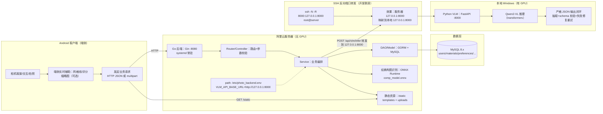
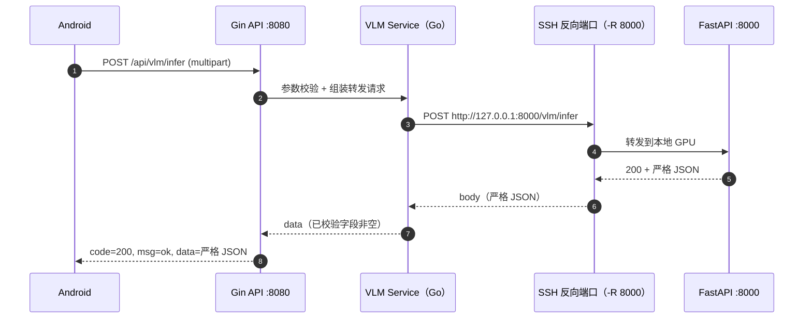
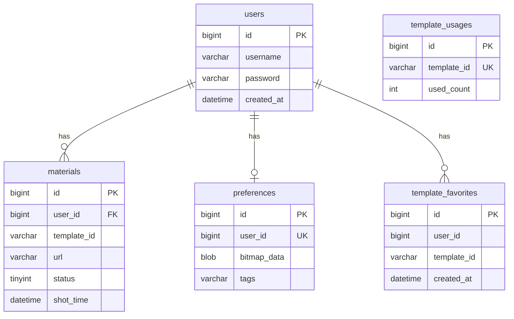

# 中国大学生计算机设计大赛｜软件开发类作品开发文档

- 作品名称：一拍即合（智能构图摄影辅助系统）
- 版本编号：V2.0（端云协同演示版 + VLM 联调版）
- 作者：__________
- 填写日期：2026-03-17

## 目录

- 第一章 需求分析
  - 1.1 开发背景
  - 1.2 市场分析
    - 1.2.1 核心痛点
    - 1.2.2 目标用户
    - 1.2.3 竞品分析
- 第二章 概要设计
  - 2.1 系统架构设计（端云协同 + 分层）
  - 2.2 模块层次结构与调用关系
- 第三章 详细设计
  - 3.1 前后端接口设计（RESTful）
  - 3.2 数据库设计（ER 与表结构）
  - 3.3 静态资源与文件存储设计
  - 3.4 关键算法与实现原理
- 第四章 测试报告
  - 4.1 测试环境
  - 4.2 测试用例与结果
  - 4.3 技术指标口径
- 第五章 安装及使用
  - 5.1 下载与安装
  - 5.2 登录注册及功能使用
- 第六章 项目总结
  - 6.1 任务分解
  - 6.2 困难与挑战
  - 6.3 升级与推广
- 参考文献

---

## 第一章 需求分析

> 说明：本章内容来自你们现有 Word 文档（txt 版）整理。

### 1.1 开发背景

傍晚时分，你站在海边，金色的落日余晖洒满海面，眼前的美景让你迫不及待地举起手机。然而，当你反复调整角度，按下快门，翻看相册时却发现，照片平平无奇。既没有捕捉到当下的震撼，也无法在朋友圈收获预期的点赞。这样的场景，每天都在无数人身上重复上演。

近年来，智能手机的普及让摄影变得前所未有的便捷，但“拍出好照片”的门槛并未因此降低。用户在应用商店中下载各类拍照软件，从美颜相机到专业模式，从滤镜大全到后期修图，试图通过各种工具弥补拍摄技巧的不足。然而，无论是号称一键美颜的应用，还是提供海量滤镜的相机，都只能解决“怎么修”的问题，却无法回答那个最根本的困惑——“我该怎么拍”。

市面上的拍照软件层出不穷，但它们大多聚焦于事后补救，通过滤镜、裁剪等后期处理来美化照片，却鲜有产品能在事前介入，在用户按下快门的瞬间，提供实时、智能、个性化的构图指导。当我们面对壮丽的日落、盛开的樱花、充满故事的街角时，需要的不是拍照后的滤镜叠加，而是拍摄前那个决定性的瞬间——主体该放在哪里，画面该如何布局，什么样的角度才能让照片脱颖而出。

正是在这样的背景下，我们决定开发这款智能构图摄影软件。不同于市面上任何一款拍照应用，我们的核心不是堆砌滤镜效果，而是将专业的构图知识转化为普通人能轻松使用的智能工具。从新手友好的实时评分缩略图，到进阶的构图类型识别，再到 AI 驱动的拍摄建议与姿势引导，我们构建了一个层层递进的智能辅助体系。无论用户是初次接触摄影的小白，还是渴望精进的爱好者，都能在这个体系中找到适合自己的成长路径。

### 1.2 市场分析

#### 1.2.1 核心痛点

在全民摄影时代，智能手机的普及极大降低了影像创作的门槛，然而构图作为决定画面美感的核心要素，却成为绝大多数用户难以跨越的瓶颈。尽管市场上已有海量拍照应用，但普遍聚焦于滤镜叠加、美颜修饰等事后处理，鲜有工具能在拍摄瞬间提供专业的构图指导。

（1）构图知识鸿沟：普通用户面对取景画面时不知如何安排主体位置，静态网格线无法根据场景动态推荐最佳构图方案。

（2）构图实时识别缺失：现有摄影 APP 多为事后补救模式，错失拍摄瞬间的最佳构图时机。

（3）个性化学习空白：用户审美偏好差异显著，但通用工具忽略个体差异，推荐规则千人一面。

（4）场景适配不足：不同场景所需构图规则差异显著，传统静态参考线无法适应变化。

（5）人像姿势盲区：姿势僵硬是常见问题，缺少结合场景的动态姿势指导。

> 注：上述痛点中，“实时评分缩略图（VPN/P-Module）”属于端侧能力；“经典构图识别（CNN/ONNX）”与“模板推荐/收藏/偏好”属于后端已落地能力；“大模型拍摄建议/姿势引导”已在本版本中通过 VLM 服务形成可对外调用的 API（开发联调形态）。

#### 1.2.2 目标用户

本作品主要面向三类核心用户群体：摄影初学者（需要实时、可理解的构图指导）；社交内容创作者（高频产出、需要效率与画面表现）；普通移动摄影爱好者（希望轻松拍出更美观的照片）。

#### 1.2.3 竞品分析（摘要）

当前移动端摄影软件市场产品众多，但普遍聚焦后期滤镜与美颜，缺乏对“拍摄过程中构图”这一核心环节的智能支持。本作品从实时构图辅助、构图类型识别、偏好学习、模板拍摄等维度进行创新，强调“拍摄前/拍摄中”的指导。

---

## 第二章 概要设计

### 2.1 系统架构设计（端云协同 + 分层）

本系统采用“端云协同 + 分层架构 + 推理服务解耦”的总体设计思路：

- 端侧（Android）负责相机交互、实时预览与用户体验；
- 云端（Go/Gin）提供统一 REST API、业务数据与静态资源能力，并承担轻量推理（ONNX 构图识别）；
- 大模型推理（VLM）独立部署为 Python 服务，云端通过 HTTP 访问；在“服务器无 GPU”的开发联调阶段，通过 SSH 反向端口转发实现云端对本地 GPU 的访问。

#### 2.1.1 系统总体架构（端-云-本地 GPU）



读图要点：

- “经典构图识别”在云端 Go 直接完成（轻量推理，适合服务器 CPU）。
- “拍摄建议/姿势引导”通过 Go 转发到 Python VLM 服务完成（更重推理，建议 GPU）。
- 开发联调阶段服务器无 GPU，所以用 SSH 反向端口转发，让 Go 访问 `127.0.0.1:8000` 时实际打到本地 GPU。

#### 2.1.2 云端后端分层架构（与代码一致）

云端后端采用清晰的分层，便于扩展与维护：

- Router（路由层）：注册 `/api/*` 路由、CORS、中间件、静态资源映射。
- Controller（控制层）：负责参数解析与校验、统一返回格式、调用 Service。
- Service（服务层）：业务逻辑编排（模板推荐/收藏/偏好/素材/推理转发）。
- DAO/Model（数据层）：数据库连接、表结构定义、AutoMigrate。

这种分层的核心价值是“职责单一 + 依赖方向清晰”：Controller 不做复杂业务、Service 不直接暴露 HTTP 语义，数据访问统一沉到 DAO/Model。

#### 2.1.3 推理服务解耦设计（ONNX 与 VLM 并存）

系统同时存在两类推理：

- ONNX 构图识别：部署在 Go 后端进程内，接口为 `/api/composition/analyze`。
- VLM 多模态大模型：独立 Python 服务，Go 通过 `/api/vlm/infer` 统一对外提供能力。

解耦的好处：

- 运行边界清晰：VLM 的 CUDA/显存依赖不影响 Go 服务稳定性。
- 部署灵活：生产环境可把 VLM 放到单独 GPU 机器上，Go 仅通过内网访问。
- 输出可控：Python 侧通过 schema 校验与自动修复重试保证“严格 JSON”，前端无需做 NLP 清洗。

### 2.2 模块层次结构与调用关系

#### 2.2.1 业务模块划分

- 用户模块：注册、登录。
- 素材模块：上传、草稿/作品列表、草稿转作品。
- 模板模块：热门列表、筛选列表、详情、搜索、推荐。
- 收藏模块：模板收藏增删查（用于“喜欢”页与推荐信号）。
- 偏好模块：偏好 tags 读写（用于个性化推荐信号）。
- 构图模块（经典构图识别）：上传图片 → ONNX 推理 → 返回构图类型与置信度。
- 大模型模块（拍摄建议/姿势引导）：上传图片 → Go 转发 → Python VLM 推理 → 返回严格 JSON。

#### 2.2.2 典型调用链（大模型：拍摄建议/姿势引导）



---

## 第三章 详细设计

### 3.1 前后端接口设计（RESTful）

#### 3.1.1 统一返回格式

后端采用“HTTP 200 + 业务 code”的返回方式（部分接口也会在参数错误时返回 HTTP 400）：

```json
{"code":200,"msg":"ok","data":{}}
```

常见业务 code：

- `200`：成功
- `400`：参数错误
- `401`：认证失败（如用户不存在/密码错误）
- `409`：冲突（如重复收藏/用户名已存在）
- `503`：服务不可用（如构图模型未初始化完成）
- `504`：下游超时（如转发 VLM 超时）

#### 3.1.2 API 列表（以当前实现为准）

- 用户
  - `POST /api/register`
  - `POST /api/login`
- 素材
  - `POST /api/materials/upload`（multipart：`image/user_id/status/template_id`）
  - `GET /api/materials/list?user_id=...&status=0|1`
  - `POST /api/materials/work/:id`（草稿转作品）
  - `POST /api/drafts/upload`（JSON：草稿同步，可选）
- 构图（经典构图识别）
  - `POST /api/composition/analyze`（multipart：`image`）
- 模板
  - `GET /api/templates/hot?limit=...&user_id(optional)`
  - `GET /api/templates/list?limit=...&tags=...&match=any|all&user_id(optional)`
  - `GET /api/templates/recommend?user_id=...&limit=...&include_favored=0|1`
  - `GET /api/templates/detail?template_id=...&user_id(optional)`
  - `GET /api/templates/search?user_id(optional)&q=...&limit=...&recommend_limit=...`
- 收藏
  - `POST /api/templates/favorites`
  - `DELETE /api/templates/favorites?user_id=...&template_id=...`
  - `GET /api/templates/favorites?user_id=...&limit=...`
- 偏好 tags
  - `GET /api/preferences/tags?user_id=...`
  - `POST /api/preferences/tags`
- 大模型（拍摄建议/姿势引导）
  - `POST /api/vlm/infer`（multipart：`task + image/file`）

#### 3.1.3 大模型接口（/api/vlm/infer）详细说明

- Method：`POST`
- Content-Type：`multipart/form-data`
- 字段：
  - `task`：`advice` 或 `pose`
  - `image` 或 `file`：图片文件（jpg/jpeg/png）

返回：

- 当 `task=advice` 时，`data` 为严格 JSON：

```json
{
  "composition": "...",
  "focus": "...",
  "atmosphere": "..."
}
```

- 当 `task=pose` 时，`data` 为严格 JSON：

```json
{
  "pose_title": "...",
  "instructions": ["...", "...", "..."]
}
```

说明：

- Go 后端会对下游返回做 JSON 解析，并做“字段非空、数组长度合理”校验，避免前端渲染异常。
- Python VLM 侧采用“强约束提示词 + JSON 抽取 + schema 校验 + 自动修复重试”闭环，确保只返回一个 JSON 对象。

### 3.2 数据库设计（ER 与表结构）

后端通过 GORM `AutoMigrate` 自动迁移表结构（启动即对齐）。核心表：

- `users`：用户
- `materials`：素材（草稿/作品）
- `preferences`：偏好（当前主要用 tags 字段）
- `template_favorites`：模板收藏
- `template_usages`：模板使用量统计



> 说明：模板本体是静态资源（文件系统），因此没有单独的 `templates` 表；收藏/使用量表仅记录与模板 ID 的关系，降低耦合。

### 3.3 静态资源与文件存储设计

#### 3.3.1 静态资源访问

- 路由：`GET /static/*`
- 映射目录：服务器 `./static`

用途：

- `static/templates/`：模板封面/示例/叠加层（overlay）与元数据 `templates.json`
- `static/uploads/`：用户上传素材

#### 3.3.2 上传文件命名与路径

后端上传接口会把图片落盘到：

- `static/uploads/u{user_id}/YYYYMMDD/{timestamp}_{rand}.jpg|png`

并返回可访问 URL：

- `http(s)://{host}/static/uploads/...`

### 3.4 关键算法与实现原理

#### 3.4.1 经典构图识别（ONNX 推理）

- 输入：单张图片（JPG/JPEG/PNG）
- 预处理：
  - Letterbox 等比例缩放到 224×224（补黑边，避免拉伸破坏构图比例）
  - RGB 通道归一化（ImageNet mean/std）
  - 张量布局：`[1, 3, 224, 224]`
- 推理：ONNX Runtime + `comp_model.onnx`
- 后处理：
  - 对输出 logits 做 Sigmoid 得到概率
  - 阈值：`0.35`，返回所有超过阈值的构图类型
  - 若无超过阈值结果：返回概率最高的 1 个作为兜底
- 输出：构图名称 + 置信度（0~100）

构图类别（9 类）：三分法、垂直线、水平线、对角线、曲线、三角形、中心、对称、框架/图案。

#### 3.4.2 模板推荐算法（可解释的打分策略）

模板推荐的目标：在“静态模板库”基础上，结合用户信号做到“越用越懂你”。

数据输入：

- 模板元数据：`static/templates/templates.json` 提供 `tags/hot` 等
- 使用量：`template_usages.used_count`（全局累加，上传作品时若带 `template_id` 则 +1）
- 收藏：`template_favorites`（每个收藏模板的 tags 作为强偏好信号）
- 偏好 tags：`preferences.tags`（用户显式选择的偏好标签）
- 作品信号：用户作品中使用过的模板的 tags（弱偏好信号）

打分（当前实现口径）：

- $score = hot + usageBoost(used\_count) + \sum tagWeight$
- `usageBoost` 为对数缩放（避免 used_count 过大碾压其他信号）
- 每命中 1 个 tag：
  - 命中「用户偏好 tags」：`+1`
  - 命中「收藏模板的 tags」：`+3`
  - 命中「作品用过的模板 tags」：`+2`

> 该策略优点：可解释、可控、便于比赛答辩；后续可平滑升级到学习型推荐。

#### 3.4.3 大模型严格 JSON 输出闭环（VLM）

大模型输出“稳定可渲染”的关键不在于一次提示词，而在于“结构化约束 + 校验 + 自动修复”的闭环。

核心设计：

1) 强约束提示词：明确禁止 Markdown、禁止多余解释、禁止额外字段，只允许输出一个 JSON。
2) JSON 抽取：对模型输出文本进行括号深度扫描，抽取第一个完整 JSON 对象。
3) schema 校验：
   - advice 只允许 `composition/focus/atmosphere`
   - pose 只允许 `pose_title/instructions[]`
   - 额外字段一律视为失败
4) 失败修复重试：把失败原因（缺字段/多字段/类型错误/长度超限等）回注给模型，让它“只输出 JSON 重写”，最多重试 2 次。

这样可以让接口在真实场景下更稳定，显著降低前端解析成本。

---

## 第四章 测试报告

### 4.1 测试环境

- 服务器端（云端）
  - OS：Linux（阿里云）
  - Go：1.20+（以 `go.mod` 为准）
  - 框架：Gin + GORM
  - 数据库：MySQL 8.0.x
  - 推理：ONNX Runtime（通过 `onnxruntime_go` 绑定）
  - 运行：systemd 常驻（读取 `/etc/photo_backend.env`）

- 本地端（VLM 推理）
  - OS：Windows
  - Python：3.10+（建议）
  - 框架：FastAPI + Uvicorn
  - 推理：HuggingFace transformers + torch（CUDA）
  - 模型：`Qwen/Qwen2-VL-2B-Instruct`

- 联调链路
  - SSH 反向端口：`-R 8000:127.0.0.1:8000`

### 4.2 测试用例与结果

#### 4.2.1 编译/依赖测试

- `go test ./...`
  - 在 Windows 若未安装 C 编译工具链（MinGW/VS Build Tools）或 `CGO_ENABLED=0`，可能出现 `onnxruntime_go` “build constraints exclude all Go files” 报错。
  - 解决建议：
    1) 安装 MinGW-w64 或 Visual Studio Build Tools（提供 `gcc`/MSVC），并确保 `CGO_ENABLED=1`；或
    2) 在 Linux/WSL2 环境运行后端（与服务器环境一致）。

#### 4.2.2 核心接口用例（建议最少覆盖）

- 用户
  - 注册成功 / 重复注册（409）
  - 登录成功 / 密码错误（401）

- 素材
  - 上传草稿/作品（status=0/1）
  - 拉取列表（按 status 分页/limit 可选）

- 模板
  - 热门 / 列表筛选 / 详情 / 搜索 / 推荐

- 收藏与偏好
  - 收藏 / 重复收藏（409）/ 取消收藏
  - 写入 tags / 读取 tags

- 构图识别（ONNX）
  - 合法图片 / 非图片
  - 大图（>10MB）触发限制
  - 模型未加载返回 503（若有该保护逻辑）

- 大模型（VLM）
  - `task=advice` 返回字段完整且无额外字段
  - `task=pose` 返回 `instructions` 为数组且条数合理
  - 下游不可达（未起隧道/未起 VLM 服务）时，Go 返回清晰错误（超时/连接失败）

示例（以 curl 为例，按实际 host 替换）：

- 注册：

`curl -X POST http://127.0.0.1:8080/api/register -H "Content-Type: application/json" -d '{"username":"u1","password":"p"}'`

- 构图分析：

`curl -X POST http://127.0.0.1:8080/api/composition/analyze -F "image=@test.jpg"`

- VLM（拍摄建议）：

`curl -X POST http://127.0.0.1:8080/api/vlm/infer -F "task=advice" -F "image=@test.jpg"`

- VLM（姿势引导）：

`curl -X POST http://127.0.0.1:8080/api/vlm/infer -F "task=pose" -F "image=@test.jpg"`

#### 4.2.3 联调链路与部署用例（建议）

- 服务器 Go：
  - `systemctl status photo_backend` 显示 active (running)
  - `journalctl -u photo_backend -n 50 --no-pager` 可看到正常启动日志

- 隧道：
  - 本地执行 SSH 反向端口命令后，服务器侧 `curl http://127.0.0.1:8000/health` 能返回 Python VLM 健康信息

### 4.3 技术指标口径

- 性能
  - 常规业务接口（模板/收藏/偏好/列表）：主要是 DB 与文件读取，响应一般为百毫秒级。
  - 构图识别（ONNX）：单张图片推理为毫秒到几十毫秒级（与机器性能相关）。
  - VLM（拍摄建议/姿势引导）：为秒级任务；Go 端通过 `VLM_HTTP_TIMEOUT_SECONDS` 控制超时（建议 180s）。

- 稳定性
  - 通过“严格 JSON 输出闭环”保证返回结构稳定，Android 可直接渲染。
  - systemd 常驻提升服务可用性，避免 ssh 断开后 Go 进程退出等问题。

- 安全性
  - 密码：bcrypt 哈希存储。
  - 现状：未引入 token 鉴权（客户端直传 `user_id`），适合演示闭环；上线需补齐鉴权。

---

## 第五章 安装及使用

> 说明：本章以你们现有文本为主体，补充与当前后端实现对齐的说明。

### 5.1 下载与安装

- 后端：见仓库内《环境配置指南》《VS Code 本地部署指南》完成 Go/MySQL/依赖安装。
- 启动：`go run main.go`

关键环境变量（可选）：

- `PHOTO_DB_DSN`：MySQL DSN（默认 `root:123456@tcp(127.0.0.1:3306)/photography_db?...`）
- `PORT`：服务端口（默认 8080）
- `COMPOSITION_MODEL_PATH`：构图模型路径（默认 `models/comp_model.onnx`）
- `ONNXRUNTIME_SHARED_LIBRARY_PATH`：Linux 部署时可显式指定 onnxruntime 动态库路径

### 5.2 登录注册及功能使用

#### 5.2.1 登录与注册

用户首次使用需注册账号，注册成功后登录进入应用。后端使用 bcrypt 对密码进行加密存储，避免明文落库。

#### 5.2.2 热门模板拍摄模块

当用户点击底部导航栏的“热门模板”图标，即可进入一个充满灵感与便捷的智能模板广场。首页采用瀑布流布局，以卡片形式呈现海量精选模板，每个卡片包含一张示例图、模板名称及使用量，可以直观展示模板热度，便于用户选择。顶部设有圆角搜索框，支持关键词搜索，例如“海边”、“春天花海”、“胶片感建筑”等，快速定位心仪场景。推荐逻辑基于模板热度（hot）、全局使用量（used_count）以及用户收藏/偏好 tags 等信号进行打分排序，实现“越用越懂你”的体验。

当用户点击任一模板后，应用跳转至模板详情页。页面中央展示该模板示例图；同时提供“收藏”按钮，用户可将心仪模板收纳至个人喜欢列表；右侧“拍同款”按钮是进入拍摄的快捷入口。点击“拍同款”后进入拍摄界面，取景区域叠加模板 overlay，并根据后端返回的 guides 在合适位置显示文字指引，帮助用户快速理解拍摄要点。

> 说明：当前后端已提供模板三图（cover/example/overlay）与结构化 guides 坐标；“一键美化/分享”等属于端侧或后续扩展能力，若你们已在客户端实现可直接描述为端侧能力。

#### 5.2.3 智能摄影拍摄模块

智能构图模块面向不同摄影水平用户提供分层辅助：

- 新手模式：端侧 VPN + P-Module 实时生成候选构图缩略图与评分，帮助用户理解“好构图”。
- 进阶模式（经典构图识别）：调用后端 `POST /api/composition/analyze`，返回构图类型与置信度；当置信度超过阈值（35%）即可提示用户当前画面可能属于某种构图。

此外，系统提供大模型能力：

- 拍摄建议：识别主体与场景，给出构图、对焦、氛围建议（advice）。
- 姿势引导：针对人像给出可执行的姿势步骤（pose）。

> 说明：大模型接口为 `/api/vlm/infer`，由 Go 转发到 Python VLM 服务；开发联调阶段通过 SSH 反向端口访问本地 GPU。

#### 5.2.4 用户界面（我的）

“我的”模块是用户个人创作与偏好的管理中心，核心包括：草稿箱、作品与喜欢。

- 草稿箱：展示云端 `materials.status=0` 的素材；支持继续编辑。
- 作品：展示 `materials.status=1` 的成品照片。
- 喜欢：展示用户收藏的模板（`template_favorites`），并作为推荐算法的重要偏好信号。

---

## 第六章 项目总结

### 6.1 任务分解

- 端云协同架构设计：明确端侧实时与云端深度能力边界。
- 后端基础工程：Gin 路由、CORS、静态资源服务、上传限制、统一返回格式。
- 数据库建设：GORM AutoMigrate，完成用户/素材/偏好/收藏/使用量等表结构。
- 业务能力闭环：模板热门/筛选/详情/搜索/推荐、收藏、偏好 tags、素材云端同步。
- AI 能力接入（轻量）：ONNX Runtime 推理实现经典构图识别并提供 API。
- AI 能力接入（重推理）：Python VLM 推理服务 + 严格 JSON 输出闭环 + Go 转发接口。
- 部署工程化：systemd 常驻 + 环境变量集中管理（EnvironmentFile）。

### 6.2 困难与挑战

- **端云边界划分**：取景实时性要求高，高频推理应尽量端侧完成；云端承担数据与较重业务。
- **服务器无 GPU 的联调形态**：为保证开发可验证，采用 SSH 反向端口转发把本地 GPU 能力“映射”到服务器，既满足云端 API 统一对外，又能完成大模型推理。
- **大模型输出不稳定**：模型容易输出说明文字或多段内容，因此必须引入“抽取 + schema 校验 + 修复重试”机制，确保前端可直接渲染。
- **部署环境差异**：systemd 环境变量、换行符（CRLF）等问题容易导致读取异常，需规范化 env 文件与日志排查流程。

### 6.3 升级与推广

- 生产化部署
  - 将 Python VLM 部署到独立 GPU 服务器或容器平台，Go 走内网直连，替代 SSH 隧道。
  - 增加健康检查与熔断：当 VLM 不可用时返回可解释的降级提示。

- 安全与账号体系
  - 引入 token 鉴权与权限控制（替代客户端直传 `user_id`）。

- 性能与稳定性
  - 给模板列表/推荐增加缓存（内存或 Redis）。
  - 对 VLM 增加并发控制、队列与超时；引入量化/蒸馏提升吞吐。
  - 引入日志与监控（请求耗时、下游错误率）。

---

## 参考文献

1. Gin Web Framework: https://github.com/gin-gonic/gin
2. GORM: https://gorm.io/
3. ONNX Runtime: https://onnxruntime.ai/
4. Howard et al., “Searching for MobileNetV3”, ICCV 2019
5. HuggingFace Transformers: https://github.com/huggingface/transformers
6. Qwen2-VL 模型与技术报告（以官方发布为准）
