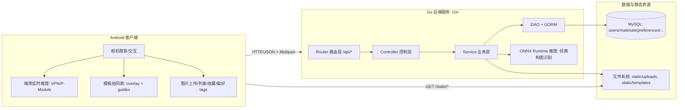
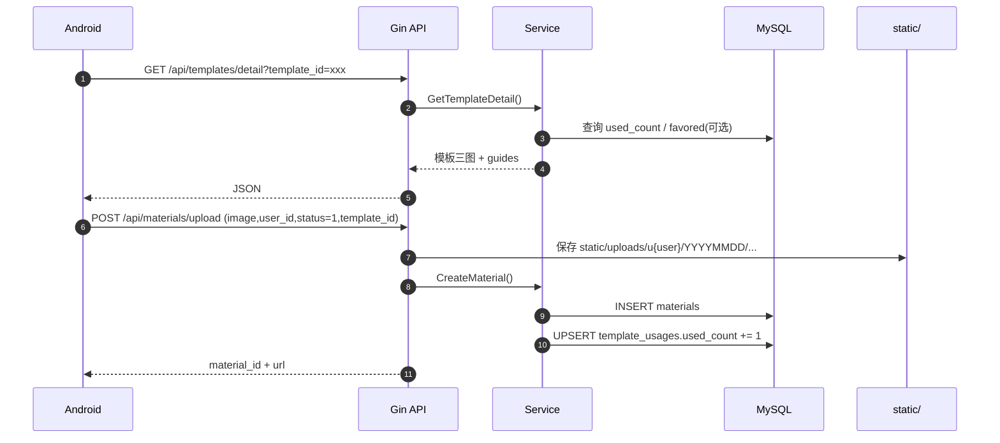
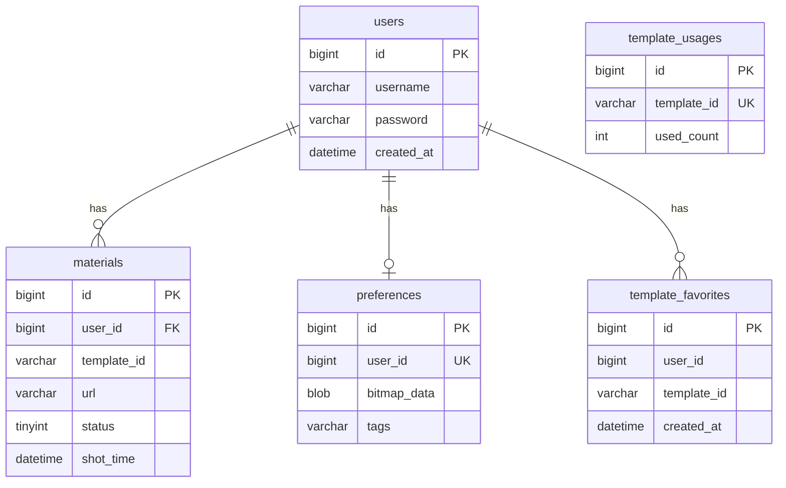

# 中国大学生计算机设计大赛｜软件开发类作品开发文档 v4

> 仅展示第二、三、四、六章（重点重写），其余章节请见 v1/v2 文档。

---

## 第二章 概要设计

### 2.1 系统架构设计（端云协同 + 分层）

本系统采用“端云协同”架构，前端（Android 客户端）负责交互与部分实时推理，云端（Go 后端 + Python VLM 服务）负责业务逻辑、AI 推理与数据存储。



### 2.2 模块层次结构与调用关系

后端采用典型分层设计，核心模块如下：

- Router：定义 URL、Method、CORS、静态资源映射
- Controller：参数校验、统一 JSON 返回
- Service：业务逻辑编排（如推荐、推理、收藏等）
- DAO/Model：GORM 连接 MySQL，定义表结构

#### 2.2.1 业务模块划分

- 用户模块：注册、登录（bcrypt 加密）
- 素材模块：上传、草稿/作品列表、草稿转作品
- 构图模块：经典构图识别（ONNX）
- 模板模块：热门、筛选、详情、搜索、推荐
- 收藏模块：模板收藏增删查
- 偏好模块：偏好 tags 读写

#### 2.2.2 典型调用链

以“模板拍同款并上传作品”为例：



---

## 第三章 详细设计

### 3.1 前后端接口设计（RESTful）

所有接口采用统一 JSON 返回格式：

```json
{"code":200,"msg":"ok","data":{}}
```

常见业务 code：200（成功）、400（参数错误）、401（认证失败）、409（冲突）、503（服务不可用）。

#### 3.1.1 主要 API 一览

- 用户
  - POST /api/register
  - POST /api/login
- 素材
  - POST /api/materials/upload
  - GET /api/materials/list?user_id=...&status=0|1
  - POST /api/materials/work/:id
- 构图
  - POST /api/composition/analyze
- 模板
  - GET /api/templates/hot
  - GET /api/templates/list
  - GET /api/templates/recommend
  - GET /api/templates/detail
  - GET /api/templates/search
- 收藏
  - POST /api/templates/favorites
  - DELETE /api/templates/favorites
  - GET /api/templates/favorites
- 偏好 tags
  - GET /api/preferences/tags
  - POST /api/preferences/tags
- VLM（大模型推理）
  - POST /api/vlm/infer

#### 3.1.2 数据库设计（ER 与表结构）



> 模板本体为静态资源，无单独 templates 表，收藏/使用量表仅记录与模板 ID 的关系。

#### 3.1.3 静态资源与文件存储

- 模板资源：static/templates/（cover/example/overlay + templates.json）
- 用户上传：static/uploads/u{user_id}/YYYYMMDD/{timestamp}_{rand}.jpg|png
- 统一通过 /static/* 路由对外暴露

#### 3.1.4 关键算法与实现原理

- 经典构图识别：ONNX 推理，letterbox 预处理，sigmoid+阈值后处理，9 类输出
- 模板推荐：hot+usageBoost+tag 权重打分，偏好/收藏/作品信号融合，可解释、可控
- VLM（大模型）：Go 转发 multipart 到 Python，Python 严格 JSON 输出+schema 校验+失败重试

---

## 第四章 测试报告

### 4.1 测试环境

- OS：Windows（本地）/ Linux（服务器）
- 语言与框架：Go + Gin + GORM
- 数据库：MySQL 8.0.x
- AI 推理：ONNX Runtime、transformers（Python）

### 4.2 测试用例与结果

- 编译/依赖测试：go test ./...，Win 下需 MinGW/VS Build Tools，Linux 推荐
- 接口联调：Postman/curl 覆盖注册、登录、上传、推理、推荐、收藏、偏好等
- 典型 curl 示例：
  - 注册：curl -X POST http://127.0.0.1:8080/api/register -H "Content-Type: application/json" -d '{"username":"u1","password":"p"}'
  - 构图分析：curl -X POST http://127.0.0.1:8080/api/composition/analyze -F "image=@test.jpg"

### 4.3 技术指标口径

- 性能：接口响应快，推理接口受模型加载影响
- 安全性：密码 bcrypt 存储，未引入 token 鉴权（适合演示，生产需补充）
- 扩展性：推荐算法、AI 能力可平滑升级

---

## 第六章 项目总结

### 6.1 任务分解

- 前端：Android 客户端 UI、交互、端侧推理
- 后端：Go 服务 API、业务逻辑、数据库、静态资源
- AI 能力：ONNX 经典构图、Python VLM 大模型
- 联调与测试：接口联调、性能与功能测试

### 6.2 困难与挑战

- 端云协同：本地 GPU 推理与云端 API 解耦，需 SSH 隧道/端口映射
- ONNX runtime 兼容性：Win/Linux 下动态库路径、CGO 编译
- 大模型输出规范化：需多轮 JSON 校验与修复，防止格式漂移
- 数据一致性：静态模板与数据库信号解耦，需同步管理

### 6.3 升级与推广

- 支持更多 AI 能力（如一键美化、风格迁移等）
- 推荐算法升级为学习型/个性化
- 完善鉴权与安全机制，适配生产环境
- 模板资源与用户数据分离，支持多端协同

---

> 参考文献、致谢等请见原文档补充。
