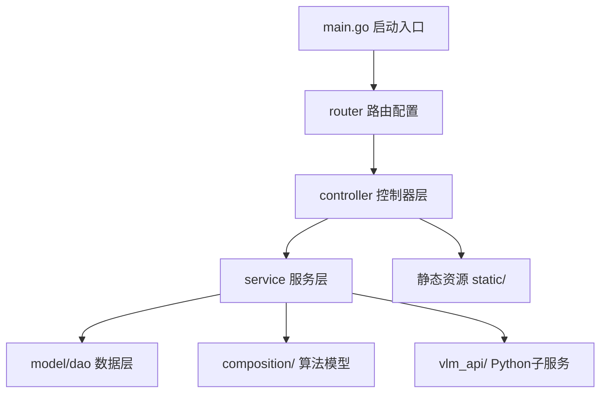
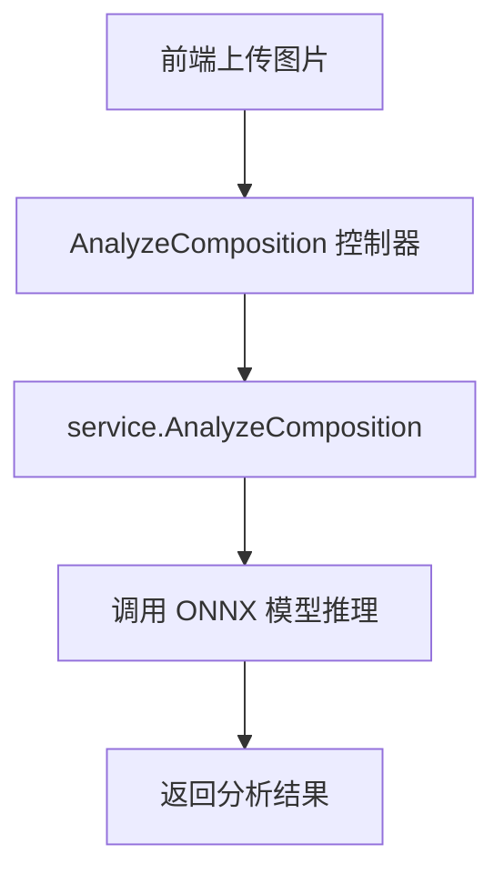
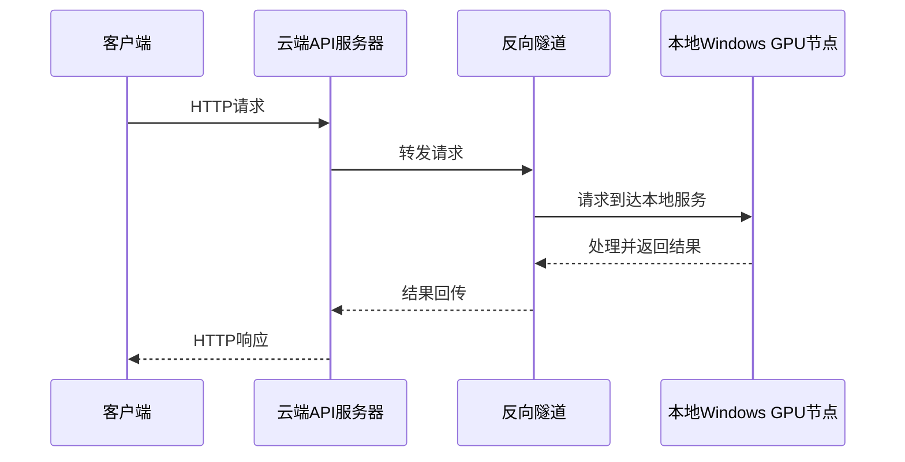

# 软件设计说明书

## 一、总体设计

本系统为基于 Go Gin 框架的照片管理与智能推荐平台，采用分层架构（MVC），后端服务支持用户管理、素材上传、构图分析、模板推荐、VLM 拍摄建议等功能。部分 AI 算法由 Python（FastAPI）子服务实现，主服务与之通过 HTTP 通信。

- **主要技术栈**：Go、Gin、GORM、MySQL、ONNXRuntime、Python FastAPI、transformers
- **部署环境**：支持 Windows/Linux，推荐 GPU 环境以加速 AI 推理

## 二、软件结构图



## 三、主要模块与功能

| 模块     | 目录/文件                                    | 主要功能描述                   |
| -------- | -------------------------------------------- | ------------------------------ |
| 启动入口 | main.go                                      | 初始化数据库、模型、加载路由   |
| 路由配置 | router/router.go                             | 注册所有 API 路由              |
| 用户     | controller/user_controller.go                | 注册、登录、信息修改、头像上传 |
| 素材     | controller/material_upload_controller.go     | 素材上传、删除、列表           |
| 构图分析 | service/composition_service.go, composition/ | ONNX 模型推理                  |
| 模板推荐 | service/template_recommend_service.go        | 热门/个性化推荐                |
| 偏好     | controller/preference_controller.go          | 偏好标签管理                   |
| VLM建议  | vlm_api/app.py                               | 拍摄建议/人像姿势 AI 推理      |
| 数据库   | dao/db.go, model/                            | MySQL 连接与表结构             |

## 三、主要模块与功能（详细说明）

### 3.1 启动入口（main.go）

负责后端服务的启动流程，包括：

- 读取环境变量，配置数据库与模型路径
- 初始化数据库连接，自动迁移表结构
- 配置并加载 ONNX 构图模型
- 加载 Gin 路由，启动 HTTP 服务

### 3.2 路由配置（router/router.go）

统一注册所有 API 路由，分组管理各功能模块接口，配置静态资源访问、CORS 跨域、上传大小限制等。

### 3.3 用户模块（controller/user_controller.go）

**功能**：用户注册、登录、信息查询与修改、密码修改、头像上传。

- 注册接口校验用户名唯一性，密码加密存储
- 登录接口校验密码，生成 Token
- 用户信息接口返回当前用户详细资料
- 支持用户名、密码、头像的修改

### 3.4 素材模块（controller/material_upload_controller.go）

**功能**：素材（照片/草稿/作品）上传、删除、列表查询、草稿转作品。

- 上传接口支持多种图片格式，自动生成存储路径和文件名
- 删除接口支持逻辑删除
- 列表接口支持分页、按用户筛选
- 草稿转作品接口支持状态变更

### 3.5 构图分析模块（service/composition_service.go, composition/）

**功能**：调用 ONNX 模型对上传图片进行构图分析，返回构图建议。

- 支持图片预处理、临时文件管理
- ONNXRuntime 推理，返回多项构图评分与建议

### 3.6 模板推荐模块（service/template_recommend_service.go）

**功能**：根据用户偏好、收藏、热门度等综合推荐模板。

- 支持关键词搜索、个性化推荐、热门模板获取
- 推荐算法可扩展，支持多种打分策略

### 3.7 偏好标签模块（controller/preference_controller.go）

**功能**：管理用户偏好标签，支持标签的增删改查。

### 3.8 VLM 拍摄建议模块（vlm_api/app.py）

**功能**：基于视觉语言大模型（如 Qwen2-VL）为用户上传图片生成拍摄建议或姿势引导。

- 支持多模型切换、并发控制、推理参数配置
- Python FastAPI 服务，主服务通过 HTTP 调用

### 3.9 数据库与数据结构（dao/db.go, model/）

**功能**：MySQL 连接管理，表结构定义与自动迁移。

- 主要表：users、materials、preferences、template_favorites、template_usages

---

## 四、接口详细说明

### 4.1 用户模块接口

| 路径               | 方法 | 功能         | 请求参数（JSON/表单）               | 响应字段         |
| ------------------ | ---- | ------------ | ----------------------------------- | ---------------- |
| /api/register      | POST | 用户注册     | username, password                  | code, msg        |
| /api/login         | POST | 用户登录     | username, password                  | code, msg, token |
| /api/user/me       | GET  | 获取用户信息 | token（Header）                     | code, msg, data  |
| /api/user/username | PUT  | 修改用户名   | user_id, username                   | code, msg        |
| /api/user/password | PUT  | 修改密码     | user_id, old_password, new_password | code, msg        |
| /api/user/avatar   | POST | 上传头像     | file（图片）                        | code, msg, url   |

**请求示例**：

```json
{
  "username": "testuser",
  "password": "123456"
}
```

**响应示例**：

```json
{
  "code": 0,
  "msg": "注册成功"
}
```

### 4.2 素材模块接口

| 路径                    | 方法   | 功能         | 请求参数（表单）                    | 响应字段        |
| ----------------------- | ------ | ------------ | ----------------------------------- | --------------- |
| /api/materials/upload   | POST   | 上传素材     | image, user_id, status, template_id | code, msg, url  |
| /api/materials/list     | GET    | 获取素材列表 | user_id, page, size                 | code, msg, data |
| /api/materials/:id      | DELETE | 删除素材     | id（路径参数）                      | code, msg       |
| /api/materials/work/:id | POST   | 草稿转作品   | id（路径参数）                      | code, msg       |

**请求示例**：
表单上传图片，字段名 image 或 file。

**响应示例**：

```json
{
  "code": 0,
  "msg": "上传成功",
  "url": "/static/uploads/u1/20260326/xxx.jpg"
}
```

### 4.3 构图分析接口

| 路径                     | 方法 | 功能     | 请求参数      | 响应字段        |
| ------------------------ | ---- | -------- | ------------- | --------------- |
| /api/composition/analyze | POST | 构图分析 | image（图片） | code, msg, data |

**响应示例**：

```json
{
  "code": 0,
  "msg": "分析成功",
  "data": [
    {"score": 0.85, "suggestion": "三分法构图良好"},
    {"score": 0.65, "suggestion": "前景略杂乱"}
  ]
}
```

### 4.4 模板推荐与收藏接口

| 路径                     | 方法   | 功能     | 请求参数    | 响应字段        |
| ------------------------ | ------ | -------- | ----------- | --------------- |
| /api/templates/recommend | GET    | 模板推荐 | user_id     | code, msg, data |
| /api/templates/hot       | GET    | 热门模板 | 无          | code, msg, data |
| /api/templates/favorites | POST   | 收藏模板 | template_id | code, msg       |
| /api/templates/favorites | DELETE | 取消收藏 | template_id | code, msg       |
| /api/templates/favorites | GET    | 收藏列表 | user_id     | code, msg, data |

---

## 五、主要数据结构与数据库设计

### 5.1 用户表（users）

| 字段名     | 类型         | 说明         |
| ---------- | ------------ | ------------ |
| id         | uint         | 主键         |
| username   | varchar(64)  | 用户名       |
| password   | varchar(128) | 密码（加密） |
| avatar     | varchar(255) | 头像URL      |
| created_at | datetime     | 创建时间     |
| updated_at | datetime     | 更新时间     |

### 5.2 素材表（materials）

| 字段名      | 类型         | 说明        |
| ----------- | ------------ | ----------- |
| id          | uint         | 主键        |
| user_id     | uint         | 用户ID      |
| template_id | varchar(128) | 模板ID      |
| url         | varchar(255) | 素材URL     |
| status      | tinyint      | 0草稿/1作品 |
| shot_time   | datetime     | 拍摄时间    |
| created_at  | datetime     | 创建时间    |
| updated_at  | datetime     | 更新时间    |

### 5.3 偏好表、模板收藏表等

（略，可参考 model/ 目录定义）

### 5.4 ER 图

```mermaid
  A[前端上传图片] --> B[UploadMaterial 控制器]
  B --> C[保存文件到 static/uploads/]
  C --> D[写入 materials 表]
  D --> E[返回图片URL]
```

---

## 六、关键算法与伪代码

### 6.1 构图分析算法（Go）

```pseudo
输入：图片文件
1. 保存图片到临时目录
2. 加载 ONNX 模型
3. 调用模型 Predict(tempFile)
4. 解析输出，生成构图建议列表
5. 返回建议与分数
```

### 6.2 模板推荐算法（Go）

```pseudo
输入：用户ID、偏好、历史收藏
1. 获取所有模板列表
2. 计算每个模板的匹配分数（如热门度、偏好标签重合、收藏权重）
3. 按分数排序，取TopN
4. 返回推荐模板列表
```

### 6.3 VLM 拍摄建议算法（Python）

```pseudo
输入：图片、提示词
1. 加载视觉语言大模型
2. 预处理图片，生成特征
3. 拼接提示词，输入模型
4. 解码输出，生成建议文本
5. 返回建议
```

---

## 七、异常处理与安全设计

- 所有接口均校验参数合法性，返回统一错误码和提示
- 用户密码加密存储，Token 认证保护敏感接口
- 上传文件校验类型与大小，防止恶意文件
- 关键操作日志记录，便于追溯
- CORS 配置、限流、SQL 注入防护

---

## 八、部署与运维设计

- 支持 Windows/Linux 部署，推荐 GPU 环境
- 依赖 MySQL、ONNXRuntime、Python 环境
- 通过 systemd/service 脚本管理服务
- 环境变量集中配置，支持多环境切换
- 日志输出到文件，支持日志轮转
- 监控建议：可接入 Prometheus、Grafana

---

## 九、性能与扩展性设计

- 支持高并发请求，Gin 框架高性能
- 静态资源分离，图片直链访问
- 业务层可横向扩展，支持多实例部署
- 算法服务与主服务解耦，便于独立扩展
- 预留缓存、CDN、分布式等扩展点

---

## 十、开发与测试流程

- 采用 Git 进行版本管理，分支开发
- 单元测试覆盖主要业务逻辑
- 集成测试覆盖接口流程
- 代码审查与自动化构建
- 提供本地与线上环境切换脚本

---

## 十一、维护与升级建议

- 代码结构清晰，便于后续功能扩展
- 支持热更新与平滑重启
- 详细文档与注释，便于新成员上手
- 未来可扩展更多 AI 算法与业务模块

---

## 十二、附录

### 12.1 主要依赖与版本

- Go 1.18+
- Gin 1.8+
- GORM 1.23+
- Python 3.9+
- FastAPI 0.95+
- transformers 4.36+
- ONNXRuntime 1.16+

### 12.2 关键配置文件说明

- deploy/systemd/photo-backend.env.example：环境变量模板
- static/：静态资源目录
- models/：模型文件目录

---

（如需进一步扩展，可继续细化每个接口、算法、数据结构、测试用例等内容）

### 3. 构图分析流程



### 4. 云本穿透机制



## 五、接口设计（部分示例）

| 路径                     | 方法 | 功能说明     | 主要参数           |
| ------------------------ | ---- | ------------ | ------------------ |
| /api/register            | POST | 用户注册     | username, password |
| /api/login               | POST | 用户登录     | username, password |
| /api/user/me             | GET  | 获取用户信息 | token              |
| /api/materials/upload    | POST | 上传素材     | image, user_id     |
| /api/materials/list      | GET  | 获取素材列表 | user_id, page      |
| /api/composition/analyze | POST | 构图分析     | image              |
| /api/vlm/infer           | POST | VLM拍摄建议  | image, prompt      |
| /api/templates/recommend | GET  | 模板推荐     | user_id            |

## 六、主要数据结构（示例）

```go
// model/material.go
// 素材表结构
Material struct {
  ID        uint
  UserID    uint
  TemplateID string
  URL       string
  Status    int // 0=草稿, 1=作品
  ShotTime  time.Time
  CreatedAt time.Time
  UpdatedAt time.Time
}
```

## 七、主要函数与算法说明

- **service.Register(username, password)**：注册新用户，校验唯一性，写入数据库。
- **UploadMaterial**：接收图片，保存到本地，写入 materials 表。
- **AnalyzeComposition**：保存上传图片到临时目录，调用 ONNX 模型推理，返回构图分析结果。
- **VLMInfer (Python)**：加载大语言视觉模型，输入图片和提示词，生成拍摄建议。
- **TemplateRecommend**：根据用户偏好、收藏、热门度等综合推荐模板。

## 八、运行与部署设计

- **依赖**：Go 1.18+、Python 3.9+、MySQL、ONNXRuntime、transformers
- **环境变量**：PHOTO_DB_DSN、COMPOSITION_MODEL_PATH、ONNXRUNTIME_SHARED_LIBRARY_PATH、VLM_MODEL_ID 等
- **启动流程**：
  1. 初始化数据库连接
  2. 配置并加载 ONNX 模型
  3. 加载路由与控制器
  4. 启动 HTTP 服务
  5. Python 子服务独立运行，主服务通过 HTTP 调用

---

---

## 十三、核心算法与函数接口详细说明

### 13.1 模板推荐算法（Go）

**主要文件**：service/template_recommend_service.go

**核心结构体与函数：**

- `type SearchRecommendParams`：推荐与搜索参数，包含模板目录、查询词、用户上下文、推荐数量等。
- `type SearchRecommendResult`：返回匹配模板与推荐模板列表。
- `func RecommendTemplates(params SearchRecommendParams) (SearchRecommendResult, error)`
  - 入口函数，综合用户偏好、收藏、热门度等因素，返回推荐模板。
  - 算法流程：
    1. 加载所有模板数据（如从 static/templates/ 目录或 JSON 文件）
    2. 若有关键词，先做基础搜索匹配
    3. 计算每个模板的推荐分数（如被收藏次数、与用户偏好标签重合度、历史使用频率等）
    4. 按分数排序，选取 TopN 作为推荐结果
    5. 返回推荐与匹配结果

**伪代码示例：**

```go
func RecommendTemplates(params SearchRecommendParams) (SearchRecommendResult, error) {
    templates := loadAllTemplates(params.TemplatesDir)
    var matches, recommended []TemplateItem
    for _, t := range templates {
        score := calcScore(t, params.User)
        if isMatch(t, params.Query) {
            matches = append(matches, t)
        }
        t.Score = score
    }
    sortByScore(templates)
    recommended = templates[:params.RecommendLimit]
    return SearchRecommendResult{Matches: matches, Recommended: recommended}, nil
}
```

---

### 13.2 经典构图模型算法（Go）

**主要文件**：service/composition_service.go、composition/composition.go

**核心结构体与函数：**

- `func InitCompositionService(modelPath string) error`：加载 ONNX 构图模型
- `func AnalyzeComposition(file *multipart.FileHeader) ([]composition.CompositionResult, error)`
  - 入口函数，接收图片文件，返回构图分析结果
  - 算法流程：
    1. 保存上传图片到临时目录
    2. 调用 compositionModel.Predict(tempFile) 进行 ONNX 推理
    3. 解析模型输出，生成多项构图建议（如三分法、对角线、前景背景等评分）
    4. 返回建议与分数列表

**伪代码示例：**

```go
func AnalyzeComposition(file *multipart.FileHeader) ([]CompositionResult, error) {
    tempFile := saveToTemp(file)
    results, err := compositionModel.Predict(tempFile)
    if err != nil {
        return nil, err
    }
    return results, nil
}
```

**输出结构体示例：**

```go
type CompositionResult struct {
    Score      float64 // 构图得分
    Suggestion string  // 建议文本，如“三分法构图良好”
}
```

---

### 13.3 VLM 拍摄建议与姿势引导算法（Python）

**主要文件**：vlm_api/app.py

**核心类与函数：**

- `POST /vlm/infer`：API接口，接收图片和提示词，返回拍摄建议或姿势引导
- `_lazy_init()`：模型懒加载，支持多模型切换
- `infer(image, prompt)`：主推理函数，输入图片和提示词，输出建议文本
  - 算法流程：
    1. 加载视觉语言大模型（如 Qwen2-VL）
    2. 对图片进行预处理（缩放、归一化等）
    3. 拼接用户输入的提示词（如“请给出拍摄建议”）
    4. 输入模型进行推理，解码输出建议文本
    5. 返回建议结果

**伪代码示例：**

```python
def infer(image, prompt):
    model, processor = _lazy_init()
    inputs = processor(image, prompt)
    output = model.generate(**inputs)
    suggestion = decode_output(output)
    return suggestion
```

**接口响应示例：**

```json
{
  "code": 0,
  "msg": "success",
  "data": {
    "suggestion": "请尝试三分法构图，人物面向光源，微笑自然。"
  }
}
```

---
